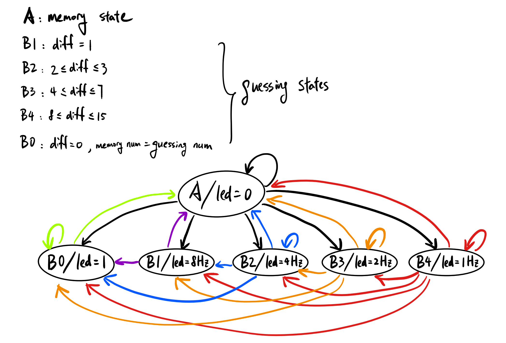

### Define a finite state machine
>A finite state machine is a mathematical model of computation, an abstract machine that can be in exactly one of a finite number of states at any given time. It can transit from one state to another in response to some inputs or a condition is satisfied.

### State Diagram from Lab 11

### Declare memory in Verilog; What kind of variable
>`reg [3:0] memory;` The type of variable is register.

### Verilog declaration for 4 bit input "guessing number"
```
input [3:0] num;
```
### Implement Top Level Module Code 
**guessing_game.v**
>isGuess: 1 bit to check if in guessing state (state 0), =0 in memory state, =1 in guessing state  
enable: 1 bit to enable to memory input number  
clk: 1 bit from the orignal clock signal  
number: 4 bit input number, in  guessing state is the guessing number, if in memory state is the memory number  
led: 1 bit output, blink, glow, or off, led = new clk to set blink frequency


```
module guessing_game(isGuess, enable, clk, number, led);
  input isGuess;
  input enable;
  input clk;
  input [3:0] number;
  output reg led;
  
  reg [3:0]store_number = 4'b1111;
  wire [2:0]state;
  wire new_clk;
  
guessing fun1(store_number, number, isGuess, state);
clock_divider fun2(clk, state, new_clk);

always @(posedge clk)
begin
  if(isGuess == 0)
  begin
    led = 0;
  end
  else if(state == 0)
  begin
    led = 1;
  end
  else
  begin
    led = new_clk;
  end
end

always @(*) 
begin
  if(isGuess == 0 && enable == 1)
  begin
    store_number = number;
  end
end
endmodule
```

**guessing.v**
>number: the 4 bit stored number (memory number)  
in_number: the 4 bit input number  
isGuess: 1 bit boolean variable  
state: 3 bit state number, state 4 when difference is 8~15, state 3 when difference is 4~7, state 2 when 2~3, state 1 when difference is 1, state 0 when input number matches stored number

```
module guessing(number, in_number, isGuess, state);
  input [3:0]number;
  input [3:0]in_number;
  input isGuess;
  output reg [2:0]state;

always @(*) 
begin
if(isGuess == 1)
  begin
    if(in_number[3] == ~number[3])
    begin
      state = 3'b100;
    end
    else if(in_number[2] == ~number[2])
    begin
      state = 3'b011;
    end
    else if(in_number[1] == ~number[1])
    begin
      state = 3'b010;
    end  
    else if(in_number[0] == ~number[0])
    begin
      state = 3'b001;
    end
    else 
    begin
      state = 3'b000;
    end
  end
end
endmodule
```
