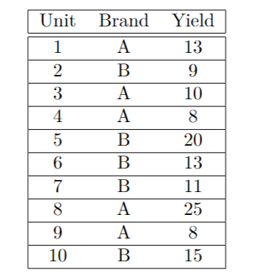
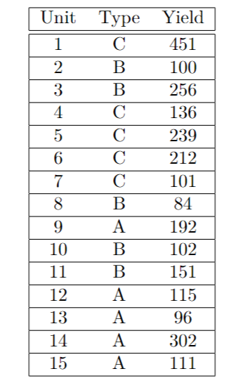

```{r setup, include=FALSE}
knitr::opts_chunk$set(echo = TRUE)
```

#### Problem 1. Define the following terms:

#### a. treatment
Combinations of factor levels are called treatments, where factor, also called an independent variable, is an explanatory variable manipulated by the experimenter.

#### b. contrast
A contrast is a linear combination of variables such that all the coefficients add up to zero. One way to think of it is as a set of weighted variables.

#### c. replicate
Replication is the repetition of an experimental condition so that the variability associated with the phenomenon can be estimated.

#### d. confounder
A confounder is a variable that influences both the dependent variable and independent variable, causing a spurious association.

#### e. response
A response variable, also known as a dependent variable, is a concept, idea, or quantity that someone wants to measure.

#### f. generalizability
Generalizability is a measure of how well a researcher thinks their experimental results from a sample can be extended to the population as a whole.

#### Problem 2. 


#### a. Enter the above data into R.
```{r}
Unit = 1:10
Brand = c("A", "B", "A", "A", "B", "B", "B", "A", "A", "B") 
Yield = c(13, 9, 10, 8, 20, 13, 11, 25, 8, 15)
data1 = data.frame(Unit, Brand, Yield)
data1
```

#### b. Run the one-way ANOVA model in R.
```{r}
library(lsmeans)
model = aov(Yield ~ Brand, data = data1)
anova(model)
lsm.data = lsmeans(model, ~Brand)
lsm.data
```

#### c. What is the least squares estimate for the contrast $τ_A−τ_B$? Compute the least square estimate in R.
```{r}
contrast1 = c(1, -1)
contrastlist = list("tau_A-tau_B" = contrast1)
contrast(lsm.data, contrastlist)
```

#### Problem 3. Consider the one-way ANOVA model $$Y_{it}=\mu+\tau_i+\epsilon_{it}$$ where $i=1,2,3,4,5$ and $t=1,...r_i$. Are the following contrasts estimable and why? If so, what are the least-squares estimate?

#### a. $τ_5−τ_1$
$\tau_5-\tau_1=(\mu+\tau_5)-(\mu+\tau_1)=\tau_5-\tau_1$, we get $b_1=-1,\;b_5=1$

#### b. $μ+τ_2+τ_3$
This cannot be estimated because we cannot find any $b_i$ in $\sum (b_i*\bar Y_{i.})$ to estimate it.

#### c. $\frac{τ_1+τ_2+τ_3}3−\frac{τ_4+τ_5}2$
$\frac{τ_1+τ_2+τ_3}3−\frac{τ_4+τ_5}2=\frac13(\mu+\tau_1)+\frac13(\mu+\tau_2)+\frac13(\mu+\tau_3)-\frac12(\mu+\tau_4)-\frac12(\mu+\tau_5)=\frac13\tau_1+\frac13\tau_2+\frac13\tau_3-\frac12\tau_4-\frac12\tau_5$

we get $b_1=\frac13,\;b_2=\frac13,\;b_3=\frac13,\;b_4=-\frac12,\;b_5=-\frac12$

#### Problem 4. 


#### a. Input the data into R.
```{r}
Unit = 1:15
Type = c("C","B","B","C","C","C","C","B","A","B","B","A","A","A","A") 
Yield = c(451,100,256,136,239,212,101,84,192,102,151,115,96,302,111) 
data2 = data.frame(Unit, Type, Yield)
data2
```

#### b. Create boxplots for each Type.
```{r}
boxplot(Yield ~ Type, data = data2, main = "")
```

#### c.Say we fit a one-way ANOVA model to this data. What are the values of the following and in words, describe what the term is.
```{r}
model2=aov(Yield ~ Type, data = data2) 
anova(model2)
lsm2=lsmeans(model2,"Type")
lsm2
sum(163, 139, 228) / 3
```
$\bar Y_{..}$ is the grand mean for the anova model, $=176.6667$

$\bar Y_{A.}$ is the ls estimate for type A, $=163$

$\bar Y_{B.}$ is the ls estimate for type B, $=139$

$\bar Y_{c.}$ is the ls estimate for type C, $=228$

#### d. Use the lsmeans package to compute $\frac{τ_A−τ_B+τ_C}2$.
```{r}
contrast2 = c(1, -1/2, -1/2)
contrastList2 = list("tau_A-1/2(tau_B+tau_C)" = contrast2) 
contrast(lsm2, contrastList2)
```

#### e.Say we want to test the hypothesis that all treatments (A, B, and C) have the same treatment mean. Write down the null hypothesis.
The null hypothesis is given by the following, $$H_0: \tau_A=\tau_B=\tau_C$$

#### f. What is the reduced model under $H_0$?
The reduced model is $\tau_A-\tau_B=\tau_B-\tau_C=\tau_A-\tau_C$

#### g. Using R, test this hypothesis at an $α=.05$ level.
```{r}
library(knitr)
summary(contrast(lsm2, method = "pairwise", adjust = "tukey"), infer = c(T, T), level = 0.95, side = "two-sided")
```
Based on the p-value, at 5% significant level, we don't reject the null hypothesis. 

#### Problem 5. Let $X\sim N(0,10)$ and $Y\sim N(4,3)$. Let $Z_i\sim N(2,10)$ for $i=1,2,...,v$. All random variables are independent to one another.

#### a. Let $F=\frac X{\sqrt{10}}$, what is the distribution of F?
$$F\sim N(\frac0{\sqrt{10}},(\frac{10}{\sqrt{10}})^2)=f\sim N(0,1)$$

#### b. Let $G=X+Y$, what is the distribution of G?
$$G\sim N(0+4,10+3)=G\sim N(4,13)$$

#### c.Let $R=\sum^{10}_{i=1}10i=1(3Z_i−2)$, what is the distribution of R?
$$\mu=(3*2-2)*10=40,\;\sigma^2=3^2*10*10=900,\;R\sim N(40,900)$$

#### d. Let $K=\sum^{20}_{i=1}(\frac{Z_i−2}{\sqrt{10}})^2$, what is the distribution of K?
$$\frac{Z_i-2}{\sqrt{10}}\sim N(0,1)$$
$$K\sim \chi^2_{(20)}$$

#### e. Find $d_1$ and $d_2$ such that: 
$$\frac{(\frac X{\sqrt{10}})^2/d_1}{\sum^{20}_{i=1}(\frac{Z_i-2}{\sqrt{10}})^2/d_2}$$

#### follows an $F$ distribution. What are the numerator degrees of freedom and denominator degrees of freedom for this distribution?
$$\frac X{\sqrt{10}}\sim N(0,1)\sim\chi^2_{(1)}$$
$$\sum^{20}_{i=1}(\frac{Z_i−2}{\sqrt{10}})^2\sim\chi^2_{(20)}$$
Therefore, we can get $d_1=1,\;d2=20$. The numerator degrees of freedom is 1 and denominator degrees of freedom is 20.

