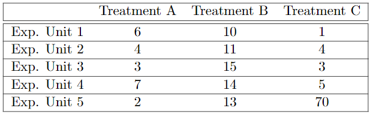

```{r setup, include=FALSE}
knitr::opts_chunk$set(echo = TRUE)
```

#### Question 3. Use R and R-markdown to answer the following questions and show all code used to answer these questions. Assume that a CRD was used for an experiment with three treatments (A, B, and C).The following table records the response variable for each experimental unit:


#### (a) Create a box-plot comparing the three treatment groups. Are there any peculiar points in the figure?
```{r}
data = data.frame("A" = c(6,4,3,7,2), "B" = c(10,11,15,14,13), "C" = c(1,4,3,5,70))
data
boxplot(data, main = "Comparing three treatment groups")
```

There is a peculiar point in group c with value 70.

#### (b) The scientist is interested in finding out if there isanyof the treatments differs from another. Write down the appropriate null hypothesis $(H_0)$ in statistical notation.
Null hypothesis: $$H_0:\tau_A=\tau_B=\tau_C$$

#### (c) Run a One-Way ANOVA analysis in R to compute the p-value for the hypothesis test outlined in (b). Do you reject or accept the null hypothesis at an $α=.05$ level?
```{r}
data = data.frame("treatment" = c(rep("A", 5), rep("B", 5), rep("C", 5)), "value" = c(6,4,3,7,2,10,11,15,14,13,1,4,3,5,70))
model = aov(value ~ treatment, data = data)
anova(model)
```

According to the anova table, we can conclude that we will accept the null hypothesis since the p-value is large than the $\alpha$ that we picked.

#### (d) The scientist now wants to test the hypothes is: $H0:\frac{τ_A+τ_B}2−τ_C=0$. Compute the p-value for this hypothesis test. Do you accept the null hypothesis at the $α=.05$ level?  You must write out the test statistic and the distribution of the test statistic for full credit.
```{r}
library(lsmeans)
lsm = lsmeans(model, "treatment")
contrast1 = c(1/2, 1/2, -1)
contrastList = list("1/2(tau_a+tau_b)-tau_c" = contrast1) 
contrast(lsm, contrastList)
```

According to the contrast table, we can see that the estimate is -8.1 and the p-value is 0.4104. Therefore, we can conclude that we accept the null hypothesis since 0.4104 is larger than the $\alpha$ that we picked. Thus $\frac{τ_A+τ_B}2−τ_C=0$.

#### (e) While working on their analysis, the scientist notes that they made a mistake in entering one of their data points. Instead, $Y_{C,5}=7$. Repeat (c) but with this change. Did the outcome of the hypothesis test change? Why? (Hint: Compute the $σ^2_A$, $σ^2_B$, and $σ^2_C$).
```{r}
data2 = data.frame("treatment" = c(rep("A", 5), rep("B", 5), rep("C", 5)), "value" = c(6,4,3,7,2,10,11,15,14,13,1,4,3,5,7))
model2 = aov(value ~ treatment, data = data2)
anova(model2)
```

According to the anova table, the p-value that we get is extremely smaller than the $\alpha$, after we change $Y_{C,5}$ to 7. Therefore, we can say that we reject the null hypothesis, thus at least one treatment has significant difference from others. 

At this point, we say the outcome of the hypothesis test changes from part(c).
```{r}
# sig_A^2
var(c(6,4,3,7,2))
# sig_B^2
var(c(10,11,15,14,13))
# old sig_C^2
var(c(1,4,3,5,70))
# new sig_C^2
var(c(1,4,3,5,7))
```

The outcome of the hypothesis test changes, because in part(c), with incorrect data, the variance of treatment group c is extremely larger than other groups, 70 is an outlier, thus we would loose precision on part(c)'s hypothesis test. Therefore after we correct the data, with smaller variance, we get more precise conclusion and p-value. 
